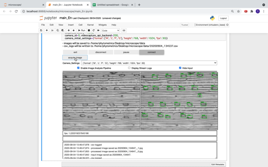

# onsite_stomata_platform
jupyter notebook based gui platform to control jetson nano connected camera through client browser.

## Data included in this repository

- SSD model (tensorflow saved_model format) trained to detect wheat stomata of imprint images
  
  - ./saved_model
  
- Manual to prepare and train a tensorflow stomata detector model in colab.

  - StomataDetectorModelTrainingManual.ipynb

  

- Example codes to execute a GUI in jupyter notebook or jupyterlab.

  - main_En.ipynb

# Data not included in this repository

please download the zip file from the following link (abt.422Mb) for using it in StomataDetectorModelTrainingManual.ipynb

https://drive.google.com/file/d/1bm9f3KW185V0U0W8-9R3-6fp0mURsBHK/view?usp=sharing

Datasets used for model training and for reproducibility

- imprint.zip
  - trainval folder: Training/Val dataset images (jpg) 
  - trainval_coco.json: Training/Val dataset annotation in **COCO json** format
  - test folder: Test dataset images (jpg)
  - test_labelbox.json: Test dataset annotation in **Labelbox json** format
  - test_coco.json: Test dataset annotation in **COCO json** format

## Requirements

- jupyter notebook
- tensorflow 2.x
- OpenCv 3.x
- other basic compoenets such as numpy etc

## Screenshots

## Instruction

 see main_En.ipynb for details

## License

MIT License

Copyright (c) 2020 yosuke toda

Permission is hereby granted, free of charge, to any person obtaining a copy
of this software and associated documentation files (the "Software"), to deal
in the Software without restriction, including without limitation the rights
to use, copy, modify, merge, publish, distribute, sublicense, and/or sell
copies of the Software, and to permit persons to whom the Software is
furnished to do so, subject to the following conditions:

The above copyright notice and this permission notice shall be included in all
copies or substantial portions of the Software.

THE SOFTWARE IS PROVIDED "AS IS", WITHOUT WARRANTY OF ANY KIND, EXPRESS OR
IMPLIED, INCLUDING BUT NOT LIMITED TO THE WARRANTIES OF MERCHANTABILITY,
FITNESS FOR A PARTICULAR PURPOSE AND NONINFRINGEMENT. IN NO EVENT SHALL THE
AUTHORS OR COPYRIGHT HOLDERS BE LIABLE FOR ANY CLAIM, DAMAGES OR OTHER
LIABILITY, WHETHER IN AN ACTION OF CONTRACT, TORT OR OTHERWISE, ARISING FROM,
OUT OF OR IN CONNECTION WITH THE SOFTWARE OR THE USE OR OTHER DEALINGS IN THE
SOFTWARE.

## Citation

If you use this code or incorporate into your program and publish a paper, please cite the following paper.

To be Defined

